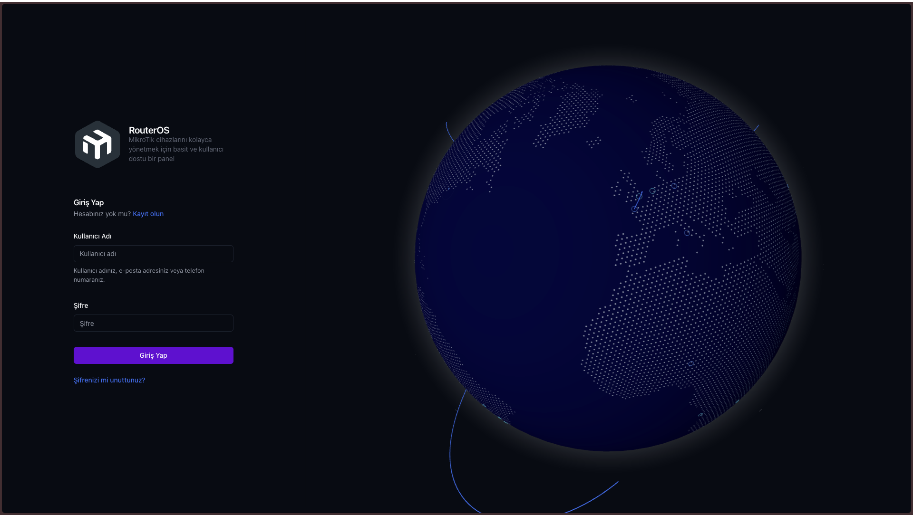
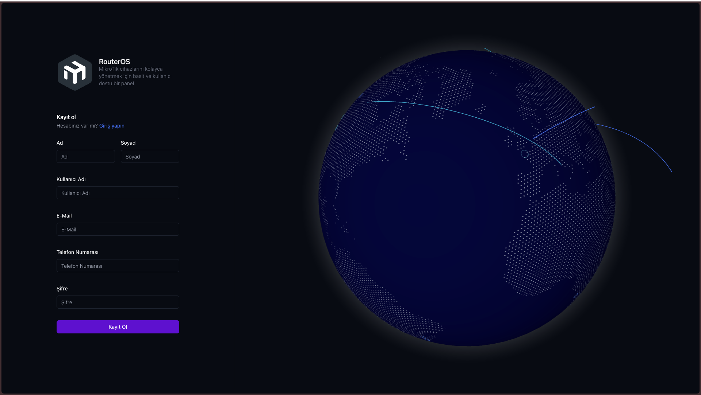
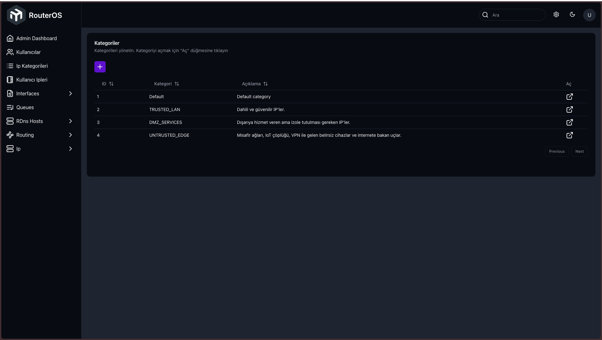

# MikroTik

[English](./markdown/README-en.md)

## İçindekiler

- [Açıklama](#açıklama)
- [Figma Tasarımı](#figma-tasarımı)
- [Özellikler](#özellikler)
- [Ekranlar](#ekranlar)
- [Teknolojiler](#teknolojiler)
  - [Front-End](#front-end)
  - [Back-End](#back-end)
- [Çalıştırmak için](#çalıştırmak-için)
  - [Kurulum](#kurulum)
  - [Geliştirme](#geliştirme)
  - [Üretim](#üretim)
- [RouteMap](#route-map)

## Açıklama

MikroTik, MikroTik cihazlarını yönetmek için bir kontrol panelidir. Cihazları, kullanıcıları, ayarları ve bildirimleri yönetmenize olanak tanıyan bir kontrol panelidir. MikroTik kullanıcılarının cihazlarını yönetmek için kullanabileceği bir kontrol panelidir.

## Figma Tasarımı

- [Figma URL](https://www.figma.com/community/file/1323695683687017923)

## Ekran Görüntüleri






## Özellikler

- **Kullanıcı kimlik doğrulama**

  - `/sign-in`, `/sign-up`
  - Kullanıcı girişi, yeni kullanıcı kaydı ve güvenli oturum yönetimi.

- **Genel landing sayfası**

  - `/`
  - Ürünün tanıtımı, temel açıklamalar ve giriş/kayıt yönlendirmeleri.

- **Dashboard – Genel görünüm**

  - `/dashboard`
  - MikroTik altyapısına ait özet metrikler, hızlı durum kontrolü.

- **Firewall yönetimi**

  - `/dashboard/firewall`
  - MikroTik firewall kurallarını listeleme, gözlemleme ve yönetme.

- **RDNS durumu ve yönetimi**

  - `/dashboard/rdns`, `/admin/rdns`, `/admin/rdns/records`
  - RDNS durumunun izlenmesi, genel RDNS ayarlarının yönetimi ve RDNS kayıtlarının listelenip düzenlenmesi.

- **Cihaz yönetimi**

  - `/dashboard/devices`
  - MikroTik cihazlarının listelenmesi, temel bilgilerin görüntülenmesi.

- **Kullanıcı profil dashboard’u**

  - `/dashboard/p/:username`
  - Kullanıcıya özel profil/detay ekranı, kullanıcıya ait kaynakların ve ayarların görüntülenmesi.

- **Rol & yetki yönetimi (Admin erişimi)**

  - `/admin`
  - Admin yetkisine sahip kullanıcılar için ayrı yönetim paneli ve özet ekranı.
    > Admin sayfasına erişmek için sağ üst köşedeki çarka tıklayınız
    > 

- **Kullanıcı yönetimi (Admin)**

  - `/admin/users`, `/admin/users/:username`
  - Kullanıcıları listeleme, filtreleme, sayfalama ve tekil kullanıcı detaylarını görüntüleme/düzenleme.

- **Queue (bandwidth) yönetimi**

  - `/admin/queues`, `/admin/queues/add`, `/admin/queues/:id`
  - Queue’ları listeleme, yeni queue oluşturma ve mevcut queue’ları güncelleme.

- **Routing – BGP yönetimi**

  - `/admin/routing/bgp`
  - BGP oturumlarının listelenmesi.
  - `/admin/routing/bgp/add`
    - Yeni BGP oturumu ekleme.
  - `/admin/routing/bgp/update/:id`
    - Mevcut BGP oturumlarını düzenleme.
  - `/admin/routing/bgp/templates`, `/admin/routing/bgp/templates/add`, `/admin/routing/bgp/templates/update/:id`
    - BGP template’lerini listeleme, oluşturma ve güncelleme.
  - `/admin/routing/tables`, `/admin/routing/tables/update/:id`
    - Routing table’ları listeleme ve güncelleme.

- **IP & ARP yönetimi**

  - `/admin/ip/arp`, `/admin/ip/arp/add`, `/admin/ip/arp/update/:id`
    - ARP kayıtlarını listeleme, yeni ARP kaydı ekleme ve mevcut kayıtları düzenleme.
  - `/admin/ip/addresses`, `/admin/ip/addresses/add`, `/admin/ip/addresses/update/:id`
    - IP adresi havuzunu yönetme, yeni IP ekleme ve mevcut IP kayıtlarını güncelleme.
  - `/admin/user-ips`, `/admin/user-ips/:id`
    - Kullanıcılara atanmış IP’leri listeleme ve tekil user-ip kayıtlarını düzenleme.

- **Kategori yönetimi**

  - `/admin/categories`, `/admin/categories/add`, `/admin/categories/update/:id`
  - Sistem içinde kullanılan kategorileri listeleme, yeni kategori ekleme ve mevcut kategorileri güncelleme.

- **Interface & tünel yönetimi**

  - `/admin/interfaces`
    - MikroTik interface’lerinin genel görünümü.
  - `/admin/interfaces/bridge`, `/admin/interfaces/bridge/:id`
    - Bridge interface oluşturma ve güncelleme.
  - `/admin/interfaces/ipip-tunnel`, `/admin/interfaces/ipip-tunnel/:id`
    - IPIP tunnel ekleme ve mevcut tünelleri düzenleme.
  - `/admin/interfaces/gre-tunnel`, `/admin/interfaces/gre-tunnel/:id`
    - GRE tunnel ekleme ve güncelleme.

- **Rol tabanlı erişim kontrolü**
  - Admin sayfalarına yalnızca yetkili kullanıcıların erişebilmesi, panel içinde rol/yetki bazlı görünürlük.

## Teknolojiler

- [TypeScript](https://www.typescriptlang.org/)

### Front-End

- [Next.js](https://nextjs.org/)
- [NextAuth.js](https://next-auth.js.org/)
- [Zustand](https://github.com/pmndrs/zustand)
- [Zod](https://zod.dev/)
- [Tailwind CSS](https://tailwindcss.com/)
- [Shadcn/UI](https://ui.shadcn.com/)
  - [Radix UI](https://www.radix-ui.com/)
- [React Icons](https://react-icons.github.io/react-icons/)

### Back-End

- [Nest.JS](https://nestjs.com/)
- [Drizzle ORM](https://drizzle.dev/)
- [PostgreSQL](https://www.postgresql.org/)
- [JWT](https://jwt.io/)
- [Bcrypt](https://www.npmjs.com/package/bcrypt)

## Çalıştırmak için

### Kurulum

```bash
cd backend
npm i # bun, pnpm, yarn da kullanılabilir
cp .env.example .env # .env dosyasını doldurmanız gerek

cd frontend
npm i
cp .env.example .env.local
```

### Geliştirme

```bash
cd backend
npm run start:dev

cd frontend
npm run dev
```

### Üretim

```bash
cd backend
npm run build
npm run start:prod

cd frontend
npm run build
npm run start
```

## Route Map

### Genel

- `/`  
  Uygulamanın ana landing sayfası.

- `/sign-in`  
  Kullanıcı giriş ekranı.

- `/sign-up`  
  Yeni kullanıcı kayıt ekranı.

### Dashboard

- `/dashboard`  
  Dashboard ana sayfası (özet/metrikler).

- `/dashboard/firewall`  
  Firewall kuralları listesi ve yönetim sayfası.

- `/dashboard/rdns`  
  RDNS durum/özet ekranı.

- `/dashboard/devices`  
  Cihazarın listelendiği sayfa.

- `/dashboard/p/:username`  
  Kullanıcıya ait profil / detay dashboard sayfası.

### Admin – Genel

- `/admin`  
  Admin ana sayfası / özet ekran.

  > Eğer kullanıcının Admin sayfalarına erişim yetkisi varsa sağ üst tarafda erişim butonu görünecektir.

- `/admin/users`  
  Kullanıcıların listelendiği sayfa (filtreleme, sayfalama vs.).

- `/admin/users/:username`  
  Tek bir kullanıcının detay sayfası.

- `/admin/queues`  
  Queue’ların (ör. bandwidth queue) listelendiği sayfa.

- `/admin/queues/add`  
  Yeni queue ekleme formu.

- `/admin/queues/:id`  
  Tek bir queue detay / güncelleme sayfası.

- `/admin/rdns`  
  RDNS ile ilgili genel ayar / işlemler sayfası.

- `/admin/rdns/records`  
  RDNS kayıtlarının listesi ve yönetim sayfası.

- `/admin/routing/bgp`  
  BGP oturumlarının listesi.

- `/admin/routing/bgp/add`  
  Yeni BGP oturumu ekleme formu.

- `/admin/routing/bgp/update/:id`  
  Var olan BGP oturumunu düzenleme ekranı.

- `/admin/routing/bgp/templates`  
  BGP template’lerinin listesi.

- `/admin/routing/bgp/templates/add`  
  Yeni BGP template ekleme formu.

- `/admin/routing/bgp/templates/update/:id`  
  Mevcut BGP template güncelleme sayfası.

- `/admin/routing/tables`  
  Routing table’ların listelendiği sayfa.

- `/admin/routing/tables/update/:id`  
  Routing table güncelleme sayfası.

- `/admin/ip/arp`  
  ARP kayıtlarının listesi.

- `/admin/ip/arp/add`  
  Yeni ARP kaydı ekleme formu.

- `/admin/ip/arp/update/:id`  
  Var olan ARP kaydı güncelleme sayfası.

- `/admin/ip/addresses`  
  IP adreslerinin listesi.

- `/admin/ip/addresses/add`  
  Yeni IP adresi ekleme formu.

- `/admin/ip/addresses/update/:id`  
  Var olan IP adresini güncelleme sayfası.

- `/admin/categories`  
  Kategori listesinin gösterildiği sayfa.

- `/admin/categories/add`  
  Yeni kategori ekleme formu.

- `/admin/categories/update/:id`  
  Mevcut kategoriyi düzenleme sayfası.

- `/admin/user-ips`  
  Kullanıcılara atanmış IP’lerin listesi.

- `/admin/user-ips/:id`  
  Tek bir user-ip kaydının detay / düzenleme sayfası.

- `/admin/interfaces`  
  Arayüzlerin (interface) genel görünümü.

- `/admin/interfaces/bridge`  
  Yeni bridge interface ekleme formu.

- `/admin/interfaces/bridge/:id`  
  Mevcut bridge interface düzenleme sayfası.

- `/admin/interfaces/ipip-tunnel`  
  Yeni IPIP tunnel ekleme formu.

- `/admin/interfaces/ipip-tunnel/:id`  
  Var olan IPIP tunnel düzenleme sayfası.

- `/admin/interfaces/gre-tunnel`  
  Yeni GRE tunnel ekleme formu.

- `/admin/interfaces/gre-tunnel/:id`  
  Var olan GRE tunnel düzenleme sayfası.
